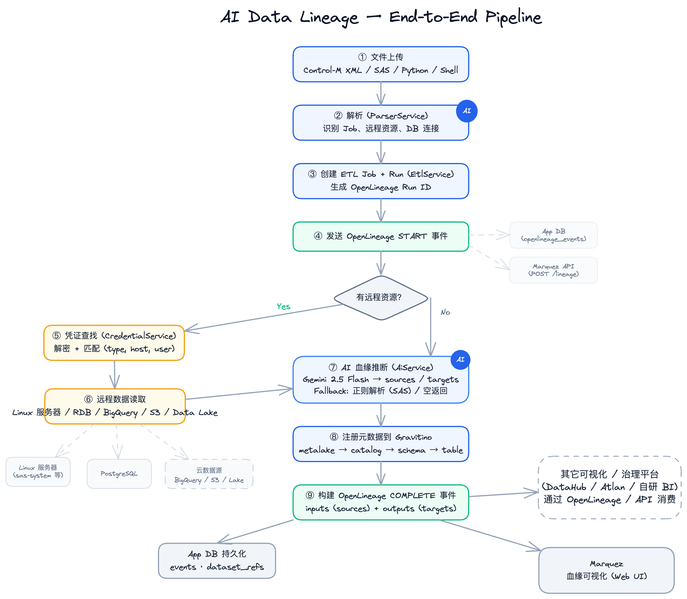
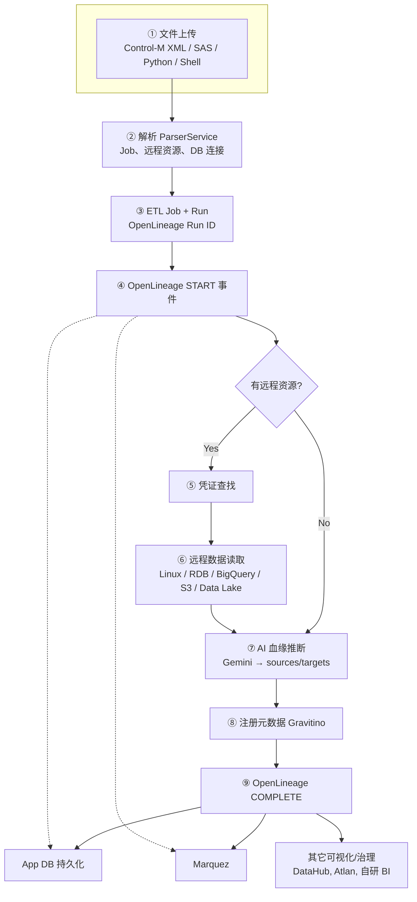

# AI Data Lineage

AI-assisted data lineage platform for Control-M XML and script inputs (SAS/Python/Shell), with metadata registration to Gravitino, OpenLineage event persistence, and Marquez visualization.

## Current Capability Snapshot

- Upload XML/scripts, parse job/resource metadata, and infer source/target lineage.
- Prompt and manage credentials for remote SSH and database access.
- Persist ETL job/run history and OpenLineage events (`START`, `COMPLETE`, `FAIL`) to app DB.
- Expose secured OpenLineage read APIs with scoped API keys and audit trail.
- Manage OpenLineage API keys and access audit records from UI admin page.
- Run full stack by Docker Compose, including simulation containers (`sas-system`, `seed-db`).

## Architecture

- Backend: FastAPI + SQLAlchemy + Pydantic.
- Frontend: React + TypeScript + Material UI + Cytoscape.
- Metadata: Gravitino (backed by PostgreSQL).
- Lineage standard: OpenLineage JSON.
- Visualization: Marquez API + Web.
- AI: Gemini (`google-genai`), with deterministic fallback behavior.

### Pipeline overview





*Detailed editable diagram: [docs/architecture.excalidraw.json](docs/architecture.excalidraw.json) — open in [Excalidraw](https://excalidraw.com). To use as image in README: export to PNG as `docs/architecture.png`.*

## Repository Structure

```text
backend/    FastAPI services, routes, models, parsers, data-source connectors
frontend/   React UI pages/components for lineage, runs, credentials, admin
docker/     Compose stack and simulation resources
docs/       Functional review, API reference, deployment, runbook
scripts/    Optional bootstrap/start helper scripts
```

## Quick Start

```bash
cd docker
docker compose up -d --build
```

- Frontend: `http://localhost:3000`
- Backend API root: `http://localhost:8000/api/v1`
- Gravitino: `http://localhost:8090`
- Marquez UI: `http://localhost:3001`

## Basic Usage

1. Open frontend and go to `Lineage Explorer`.
2. Upload `example_scripts/etl_process_controlm.xml`.
3. If prompted, fill missing credentials:
   - SSH: host `sas-system`, user `sasuser`, port `22`
   - PostgreSQL: host `seed-db`, user `seeduser`, db `seed_db`, port `5432`
4. Review graph/table result and run details.
5. Optionally verify OpenLineage records via `Runs` page and Marquez link.

## Runtime Configuration

Main env vars are defined in `docker/docker-compose.yml`:

- `DATABASE_URL`: app DB for credentials/runs/events/audits.
- `GRAVITINO_URL`: Gravitino base URL.
- `MARQUEZ_URL`: Marquez API URL.
- `GEMINI_API_KEY`: Gemini key for AI lineage extraction.
- `ENCRYPTION_KEY`: credential encryption key.
- `OPENLINEAGE_REQUIRE_API_KEY`: enable/disable read API auth.
- `OPENLINEAGE_API_KEYS`: static read keys (comma-separated).
- `OPENLINEAGE_ADMIN_KEY`: admin key for key-management endpoints.

## Documentation Index

- `docs/README.md`: docs directory index.
- `docs/FEATURE_REVIEW.md`: completed-function review with risks and recommendations.
- `docs/API_REFERENCE.md`: backend API reference and request examples.
- `docs/DEPLOYMENT_WINDOWS_OFFLINE.md`: Windows offline migration with Docker image bundle.
- `docs/OPERATIONS_RUNBOOK.md`: runbook, checks, troubleshooting, and operational tips.
- `docs/MULTI_DATASOURCE_GUIDE.md`: quick guide for simulated multi-source environment.

## Security Notes

- Credentials are encrypted at rest in app DB.
- Do not commit real secrets (`.env`, API keys, passwords).
- Replace default `ENCRYPTION_KEY` and OpenLineage keys in production.
- Current CORS is local-focused (`localhost`); tighten for enterprise environments.

